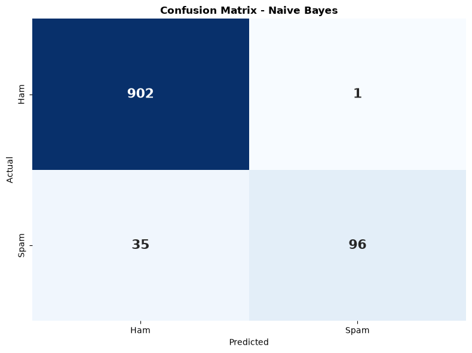

📱 Spam SMS Classifier

A Machine Learning project that classifies SMS messages as **Spam** or **Ham (Not Spam)** using Natural Language Processing.


🎯 Overview

This project implements a complete NLP pipeline to automatically detect spam messages with **97.97% accuracy**. It compares two popular ML algorithms: **Multinomial Naive Bayes** and **Linear SVM**.

📊 Results

| Model | Accuracy | Precision | Recall | F1-Score |
|-------|:--------:|:---------:|:------:|:--------:|
| Naive Bayes | 96.52% | 98.99% | 73.28% | 84.21% |
| **Linear SVM** | **97.97%** | 98.50% | 89.31% | **93.69%** |

🖼️ Confusion Matrix



✨ Features

- ✅ Complete text preprocessing (tokenization, stopwords, lemmatization)
- ✅ TF-IDF feature extraction (unigrams + bigrams)
- ✅ Two ML models trained and compared
- ✅ Interactive prediction system
- ✅ Model saved as `.pkl` for deployment
- ✅ Step-by-step Jupyter Notebook

🛠️ Technologies Used

- **Language:** Python 3.14
- **Libraries:** Scikit-learn, NLTK, Pandas, NumPy, Matplotlib, Seaborn
- **IDE:** Jupyter Notebook / VS Code

📂 Project Structure

```
spam-sms-classifier/
├── spam_classifier.ipynb        # Jupyter Notebook
├── spam_classifier.py            # Python script
├── spam_classifier_model.pkl     # Trained model
├── tfidf_vectorizer.pkl          # TF-IDF vectorizer
├── confusion_matrix.png          # Evaluation graph
├── Spam_Classifier_Project_Report.pdf
└── README.md
```

🚀 How to Run

1. Clone the repository
```bash
git clone https://github.com/YOUR_USERNAME/spam-sms-classifier.git
cd spam-sms-classifier
```

2. Create environment
```bash
conda create -n spam_env python=3.11 -y
conda activate spam_env
```

3. Install dependencies
```bash
pip install pandas numpy scikit-learn matplotlib seaborn nltk
```

4. Download dataset : `spam.csv` from [Kaggle SMS Spam Dataset](https://www.kaggle.com/datasets/uciml/sms-spam-collection-dataset)

5. Run the project
```bash
python spam_classifier.py
```
Or open `spam_classifier.ipynb` in Jupyter Notebook.

💬 Sample Predictions

| Message | Prediction |
|---------|:----------:|
| "WIN $1000! Text WIN to 12345 now!" | 🚨 SPAM |
| "Hey, are we free for lunch tomorrow?" | ✓ HAM |
| "URGENT: Your account is locked!" | 🚨 SPAM |
| "Thanks for the help yesterday!" | ✓ HAM |

📈 Top Spam Indicators

`free`, `winner`, `prize`, `claim`, `urgent`, `txt`, `cash`, `won`, `mobile`, `reply`

📄 Project Report

Full report available: [Spam_Classifier_Project_Report.pdf](Spam_Classifier_Project_Report.pdf)

📚 Dataset

- **Source:** [UCI SMS Spam Collection](https://archive.ics.uci.edu/ml/datasets/SMS+Spam+Collection)
- **Size:** 5,572 messages (5,169 after deduplication)
- **Classes:** Ham (87.4%) and Spam (12.6%)

👨‍💻 Author

Name : SHREYASH DAS
- GitHub:[sdasx-exe](https://github.com/sdasx-exe)
- Email: shubhxyash@outlook.in

📜 License

This project is licensed under the MIT License.

 🙏 Acknowledgments

This project was completed as part of the **Machine Learning Internship Program** at **Denvey EduGrow**.

- **Internship Provider:** Denvey EduGrow
- **Program:** Python Programming & Introduction to Machine Learning Training and Internship.
- **Dataset:** [UCI SMS Spam Collection](https://archive.ics.uci.edu/ml/datasets/SMS+Spam+Collection)
- **Libraries:** Scikit-learn, NLTK, Pandas, NumPy, Matplotlib, Seaborn

Special thanks to the mentors and team at **Denvey EduGrow** for their guidance and support throughout this internship program.

